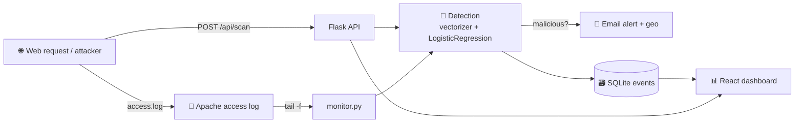

<div align="center">

# 🛡️ SQLInsight

### Machine-Learning Intrusion Detection System for SQL Injection Attacks

*Real-time detection · email alerting · live monitoring dashboard*

Built with **Python + scikit-learn** (logistic regression) and a **React** dashboard,
served by **Flask**. Reproduces and **improves on** the bachelor thesis
*"Machine Learning-Based Intrusion Detection System for Detecting SQL Injection
Attacks in Web Applications"* (Alqaiyas Qasim Al Sulaimi, German University of
Technology in Oman).

</div>

---

## ✨ What it does

SQLInsight inspects incoming web requests, classifies each query as **malicious**
or **benign** with a trained logistic-regression model, **records** every
detection, **alerts** administrators by email in real time, and visualizes the
threat landscape on a live **dashboard** — exactly the system described in the
thesis, rebuilt as a modern, runnable product.

- 🧠 **Accurate ML detection** — logistic regression over SQL-aware word + character n-grams.
- ⚡ **Real-time** — inline API detection **and** a thesis-faithful `tail -f` access-log monitor.
- 📧 **Email alerts** — Gmail SMTP alert with timestamp, source IP, **geolocation**, attack type, and payload.
- 📊 **Live dashboard** — KPIs, threat timeline, attack-type breakdown, top source IPs, geographic spread, and a live detection feed.
- 🔬 **Interactive scanner** — paste any query and get an instant verdict + confidence.
- 🍎 **Clone-and-run on macOS** — model and dashboard are pre-built; only `pip install` is required.

---

## 📈 Results — it beats the thesis baseline

| Metric | Thesis Exp 1 | **SQLInsight Exp 1** | Thesis Exp 2 | **SQLInsight Exp 2 (full)** | **SQLInsight Exp 2 (honest unseen)** |
|---|---|---|---|---|---|
| Accuracy | 99.08% | **99.71%** | 84.51% | **92.36%** | **90.35%** |
| Precision | 99.03% | **99.96%** | 79.04% | **98.74%** | **98.49%** |
| Recall | 98.47% | **99.25%** | 95.88% | 86.52% | 84.23% |
| F1 | 98.75% | **99.60%** | 86.65% | **92.23%** | **90.80%** |

- **Experiment 1** = held-out 20% of `Modified_SQL_Dataset.csv` (~30.9k rows).
- **Experiment 2** = generalisation to `clean_sql_dataset.csv` (~148k rows). Because the training set is ~entirely contained in this file, we also report **unseen-only** — the honest generalisation number — which still **beats the thesis's 84.51% by ~6 points**.

> Numbers are produced by `python ml/train_model.py` and stored in
> [`ml/artifacts/metrics.json`](ml/artifacts/metrics.json). See [`docs/MODEL.md`](docs/MODEL.md).

---

## 🚀 Quick start (macOS)

```bash
git clone <your-repo-url> sqlinsight
cd sqlinsight

./run.sh           # creates venv, installs deps, starts the server
```

Then open **http://127.0.0.1:5000**.

Generate some live traffic in a second terminal:

```bash
source .venv/bin/activate
python backend/simulate_traffic.py 60 0.35     # 60 requests, ~35% attacks
python backend/simulate_traffic.py loop        # continuous stream
```

> No build step needed: the React dashboard is pre-built into `frontend/dist/`
> and the model is pre-trained in `ml/artifacts/`. Full guide:
> [`docs/DEPLOYMENT_MAC.md`](docs/DEPLOYMENT_MAC.md).

### Email alerts (optional)

Edit `.env` (created from `.env.example` on first run) and set `ALERTS_ENABLED=true`
with your Gmail address + a 16-char [App Password](https://myaccount.google.com/apppasswords).
`.env` is **gitignored** — credentials are never committed.

### Monitor a real web server (thesis-faithful)

```bash
python backend/monitor.py /var/log/apache2/access.log
```

---

## 🏗️ Architecture



Two detection paths feed one event store and one dashboard:
1. **Inline** — `POST /api/scan` (used by the dashboard scanner & the demo site).
2. **Log monitor** — `backend/monitor.py` tails an access log with `tail -f`, exactly as in the thesis deployment.

Details + the thesis 9-stage mapping: [`docs/ARCHITECTURE.md`](docs/ARCHITECTURE.md).

---

## 🤖 Built by a multi-agent swarm (ruflo)

This project was implemented as a coordinated **multi-agent swarm** using
[**ruflo**](https://github.com/ruvnet/ruflo) — a Researcher, ML Engineer, Backend
Engineer, Frontend Engineer, Docs Writer, Security Reviewer, and Integrator/QA,
coordinated by an orchestrator, with the Frontend and Docs tracks built **in
parallel** against a frozen API contract.

- 📋 The full plan, topology, agent roster & task DAG: [`docs/IMPLEMENTATION_PLAN.md`](docs/IMPLEMENTATION_PLAN.md)
- 🛠️ Installing & driving ruflo: [`docs/RUFLO_GUIDE.md`](docs/RUFLO_GUIDE.md)
- ⚙️ Ready-to-run swarm config: [`ruflo/`](ruflo/)

---

## 📁 Project structure

```
sqlinsight/
├── ml/                     # ML pipeline
│   ├── preprocess.py       #   loader + feature vectorizer
│   ├── train_model.py      #   train + evaluate (exp1 & exp2)
│   └── artifacts/          #   ML_model.pkl, vectorizer.joblib, metrics.json  (committed)
├── backend/                # Flask app
│   ├── app.py              #   API + serves the dashboard
│   ├── detection.py        #   load model, detect(query)
│   ├── database.py         #   SQLite event store + stats
│   ├── monitor.py          #   tail -f log monitor (thesis-faithful)
│   ├── alerts.py           #   Gmail email alerts
│   ├── geoip.py            #   IP geolocation
│   ├── accesslog.py        #   Apache log write + parse
│   └── simulate_traffic.py #   demo traffic generator
├── frontend/               # React + Vite + TS dashboard  (dist/ committed)
├── data/                   # datasets (Modified_* = train, clean_* = eval)
├── docs/                   # architecture, model, api, dataset, deployment, ruflo plan
├── ruflo/                  # multi-agent swarm config
├── config.py               # central configuration (.env driven)
├── requirements.txt        # pinned Python deps
├── setup.sh / run.sh       # macOS one-command setup & run
└── .env.example            # config template (real .env is gitignored)
```

---

## 📚 Documentation

| Doc | Contents |
|---|---|
| [ARCHITECTURE.md](docs/ARCHITECTURE.md) | System design, data flow, thesis-stage mapping, DB schema |
| [MODEL.md](docs/MODEL.md) | ML pipeline, features, results, comparison vs thesis, retraining |
| [API.md](docs/API.md) | REST endpoint reference with examples |
| [DATASET.md](docs/DATASET.md) | Datasets, labels, overlap finding, sources |
| [DEPLOYMENT_MAC.md](docs/DEPLOYMENT_MAC.md) | Step-by-step macOS deployment |
| [IMPLEMENTATION_PLAN.md](docs/IMPLEMENTATION_PLAN.md) | Multi-agent (ruflo) plan |
| [RUFLO_GUIDE.md](docs/RUFLO_GUIDE.md) | Installing & driving the ruflo swarm |

---

## ⚠️ Scope & ethics

SQLInsight **detects and alerts** — it does not execute SQL or attack anything. It
only *classifies* query strings. Use it to defend your own applications. The
bundled attack payloads exist solely to train and demonstrate the detector.

## 🙏 Credits

Based on the thesis by **Alqaiyas Qasim Al Sulaimi**, supervised by Dr. Waseem
Raja Anwar and Dr. Nabil Sahli, German University of Technology in Oman (2026).
Datasets: Kaggle *biggest-sql-injection-dataset* and the GitHub *SQL-Injection-Detection* corpus.
