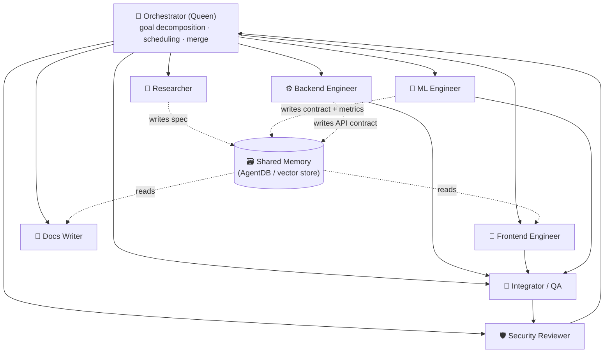
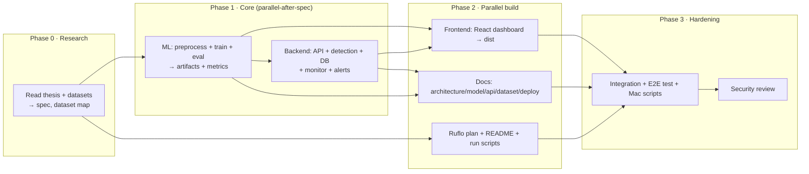

# SQL Injection Detection & Defense Engine — Implementation Plan

> **Project:** SQL Injection Detection and Defense in Online Banking Applications
> **Module:** Detection & Defense Engine (Developer 2)
> **Base repo:** SQLInsight
> **Time budget:** 1 day
> **Last updated:** 2026-10-03

---

## 1. Project Objective

Transform SQLInsight (a standalone academic ML-IDS demo) into a **production-grade SQLi Detection & Defense Engine** that:

1. Accepts incoming HTTP parameters from SecureBank via a clean REST API
2. Runs **multiple complementary detectors** (rule-based + ML ensemble)
3. Returns a structured security decision (ALLOW / BLOCK / REVIEW) with rich metadata
4. Persists all security events for monitoring and research evaluation
5. Provides a live dashboard showing attack patterns, detector behavior, and research metrics
6. Can be replayed against Red-Team Agent payloads for offline evaluation

All offensive testing is confined to the controlled local project environment.

---

## 2. Existing Architecture (Verified by Code Inspection)

### What SQLInsight Is Today

A single-process Flask application serving:
- A **pre-trained Logistic Regression** classifier (`ML_model.pkl`, scikit-learn 1.8.0)
- Feature pipeline: `CountVectorizer(word 1-2gram + char_wb 3-5gram)` + `VarianceThreshold` = 80,650 features
- A **regex classifier** for attack category labeling (9 categories; does NOT decide verdict)
- **SQLite event store** (`runtime/sqlinsight.db`) with one `events` table
- A **React 19 + TypeScript + Vite + Tailwind** dashboard (pre-built, served by Flask)
- Email alerts via Gmail SMTP with per-IP cooldown
- IP geolocation (ipinfo.io or ip-api.com fallback)
- An Apache-log-style monitor (`monitor.py`) that tails access.log and feeds the same DB

### Verified Inference Flow

```
POST /api/scan {query, source_ip?, ...}
  -> detection.detect(query)
      -> vectorizer.transform([query])
      -> model.predict_proba(X)[0][1]  (P malicious)
      -> THRESHOLD = 0.5 -> prediction 0|1
      -> classify_attack_type(query)   (regex; descriptive only)
  -> geoip.geolocate(source_ip)
  -> accesslog.write_access_log(...)
  -> database.insert_event(event)
  -> alerts.send_alert(event)         (if malicious + SMTP configured)
  -> return full event JSON
```

### Model Performance (Verified from metrics.json)

| Experiment | Accuracy | Precision | Recall | F1 |
|---|---|---|---|---|
| Exp 1 (in-distribution, 80/20) | 99.71% | 99.96% | 99.25% | 99.60% |
| Exp 2 unseen-only (honest generalisation) | 90.35% | 98.49% | 84.23% | 90.80% |

The **unseen recall of 84.23%** is the honest number — approximately **16% of novel attack patterns are missed** by the single LR model alone. This is the primary research gap this project addresses.

### Smoke Test Result (Verified)

```
21 passed, 0 failed  (model, detection, database, live API all pass)
```

---

## 3. Gap Analysis

### 3.1 What EXISTS and is Fully Working

| Component | Status | Notes |
|---|---|---|
| LogisticRegression ML detector | EXISTS | Trained, committed, 21/21 tests pass |
| Feature pipeline (word+char n-grams) | EXISTS | Reproducible via `ml/preprocess.py` |
| Regex attack-type classifier (9 categories) | EXISTS | Descriptive only; no false-verdict risk |
| `POST /api/scan` detection endpoint | EXISTS | Clean JSON interface |
| SQLite event storage | EXISTS | Full schema with indexes |
| React dashboard (KPI, timeline, attack types, geo, live feed) | EXISTS | Built, served by Flask |
| Model performance panel | EXISTS | Exp1 + Exp2, confusion matrix |
| Interactive scanner in dashboard | EXISTS | Manual payload testing |
| Email alerting (SMTP) | EXISTS | Per-IP cooldown |
| Geolocation enrichment | EXISTS | ipinfo.io / ip-api.com |
| Access log writer + tail monitor | EXISTS | Apache-style, thesis-faithful |
| Traffic simulator (`simulate_traffic.py`) | EXISTS | Mix of benign + malicious |
| Config + .env system | EXISTS | All settings externalised |
| Tests (smoke) | EXISTS | 21 checks, passes |

### 3.2 What is PARTIAL (exists but needs modification)

| Component | Gap |
|---|---|
| Rule-based detection | Regex exists but NOT used for verdict. `classify_attack_type` is purely descriptive. Needs promotion into an actual parallel detector with its own verdict output. |
| `source` field on events | Field stored but no structured tagging for SecureBank endpoints or Red-Team sessions |
| `/api/stats` response | Good aggregations but no per-detector breakdown, no blocked/allowed split, no latency metrics |
| Decision response | Returns `verdict: Suspicious/Normal` — no explicit `action: BLOCK/ALLOW/REVIEW` |
| Dashboard model performance panel | Shows static training metrics, not live per-detector runtime behavior |
| `simulate_traffic.py` | Does not label expected outcomes, so cannot compute FP/FN from Red-Team sessions |

### 3.3 What is MISSING (must be added)

| Component | Priority |
|---|---|
| Second ML model (Random Forest) | P0 |
| Ensemble / hybrid decision layer | P0 |
| `action` field (BLOCK/ALLOW/REVIEW) on API response | P0 |
| `detectors[]` field on API response (per-detector results) | P0 |
| `POST /api/evaluate` endpoint | P0 |
| Per-session evaluation tracking | P0 |
| Dashboard: Detector comparison panel | P0 |
| Dashboard: Blocked vs Allowed vs Reviewed chart | P0 |
| Dashboard: Session Evaluation panel | P0 |
| Extended `/api/stats` with detector and action breakdowns | P0 |
| `GET /api/detectors` metadata endpoint | P1 |
| `GET /api/sessions` endpoint | P1 |
| Dashboard: Detection Latency chart | P1 |
| Dashboard: Detection gaps / missed attacks view | P1 |
| `ml/evaluate_session.py` offline evaluation script | P1 |
| `collected_payloads.jsonl` capture for novel attacks | P1 |

### 3.4 What is NOT REQUIRED (safely ignored)

| Component | Reason |
|---|---|
| ruflo/swarm configuration | Build system artefact; not needed at runtime |
| macOS deployment scripts (setup.sh, run.sh) | Windows dev environment; run.bat suffices |
| Email alerting (SMTP) | Not essential for demo; already works if configured |
| Live model retraining | Unsafe, impractical in 1 day; offline evaluation is sufficient |

---

## 4. Target Architecture

### 4.1 Core Design Decisions

1. **Keep the existing stack** — Flask, SQLite, React+Vite. No new frameworks.
2. **Promote the regex classifier** into a real parallel `RuleDetector` with its own verdict output.
3. **Add a second ML model** (Random Forest) trained on the same dataset — small training delta, high research value.
4. **Ensemble layer** aggregates detector outputs into `action: ALLOW|BLOCK|REVIEW`.
5. **Extend the `events` schema** — add `action`, `detection_latency_ms`, `session_id`, `detectors_json`.
6. **Extend the API** — add `action`, `detectors[]`, `latency_ms` to `/api/scan` response; add new endpoints.
7. **Extend the dashboard** — add detector comparison, action breakdown, and session evaluation panels.

### 4.2 System Architecture Diagram

```
SecureBank (Developer 1)
    |
    |  POST /api/scan  {query, source_ip, endpoint, session_id, ...}
    v
+----------------------------------------------------------+
|               Detection & Defense Engine                  |
|                  (backend/app.py)                         |
|                                                           |
|  +-----------------------------------------------------+  |
|  |              Detection Orchestrator                 |  |
|  |           (backend/detection.py)                    |  |
|  |                                                     |  |
|  |  [RuleDetector]  [LRDetector]    [RFDetector]       |  |
|  |  regex/9rules    LR existing     RF new (P0)        |  |
|  |       |               |               |             |  |
|  |       +---------------+---------------+             |  |
|  |                       |                             |  |
|  |          [Ensemble Decision Layer]                  |  |
|  |          (backend/ensemble.py)                      |  |
|  |          -> action: BLOCK | ALLOW | REVIEW          |  |
|  +-----------------------------------------------------+  |
|                          |                                 |
|  [Event Storage: SQLite with extended schema]              |
|  events + action + detectors_json + latency + session_id  |
|                                                            |
|  API Surface:                                              |
|    POST /api/scan     POST /api/evaluate                   |
|    GET  /api/events   GET  /api/stats                      |
|    GET  /api/detectors GET /api/sessions                   |
|    GET  /api/health   GET  /api/model                      |
+----------------------------------------------------------+
                           |
               [React Dashboard  frontend/]
               Existing panels + new panels:
               - Detector Comparison (LR vs RF vs Rule)
               - Action Breakdown (BLOCK/ALLOW/REVIEW)
               - Session Evaluation (Red-Team results)
```

### 4.3 Detectors

| # | Detector | Type | Verdict basis | Speed | Strength |
|---|---|---|---|---|---|
| 1 | RuleDetector | Regex (9 patterns) | Pattern match | ~0.1ms | Explainable, zero FP on canonical attacks |
| 2 | LRDetector | LogisticRegression (existing) | P(malicious) >= 0.5 | ~2ms | High precision 99.96%, good recall on known patterns |
| 3 | RFDetector | RandomForestClassifier (new) | P(malicious) >= 0.5 | ~5ms | Better recall on boundary cases, feature importances for research |

**Ensemble logic (bank context = high security):**
- ANY detector votes Suspicious -> action = BLOCK
- All vote Normal -> action = ALLOW
- Detectors disagree -> REVIEW flag added to response
- Confidence reported per-detector and as ensemble average

**Why Random Forest over other models:**
- Same training data as LR = directly comparable (fair research comparison)
- Tree-based = handles non-linear boundaries LR misses
- Feature importances = explainability for the research paper
- ~30-60 second training time = feasible in 1 day
- No new dependencies (scikit-learn already installed)

---

## 5. Proposed Components

### 5.1 Reuse Unchanged

- `ml/preprocess.py` — shared feature pipeline for all ML models
- `backend/accesslog.py`
- `backend/geoip.py`
- `backend/alerts.py`
- `backend/monitor.py`

### 5.2 Modify

| File | Change |
|---|---|
| `backend/detection.py` | Refactor into multi-detector architecture; add RuleDetector, LRDetector wrapper, RFDetector; expose `detect_multi()` |
| `backend/app.py` | Update `/api/scan` to use `detect_multi()`; add `/api/evaluate`, `/api/detectors`, `/api/sessions` |
| `backend/database.py` | Add new columns (migration-safe ALTER TABLE); update `get_stats()` for detector/action breakdown |
| `ml/train_model.py` | Add RF training; save `RF_model.pkl`; extend `metrics.json` with RF results |
| `config.py` | Add `RF_MODEL_PATH`, `EVAL_LOG_PATH` |
| `frontend/src/types.ts` | Add `DetectorResult`, extended `ScanEvent`, `SessionResponse` types |
| `frontend/src/App.tsx` | Add data-fetching hooks for detector/session data |

### 5.3 Add (New Files)

| File | Purpose |
|---|---|
| `backend/ensemble.py` | Aggregates detector outputs into final `action` |
| `ml/artifacts/RF_model.pkl` | Trained Random Forest (generated by updated train_model.py) |
| `frontend/src/components/DetectorComparison.tsx` | Side-by-side detector stats panel |
| `frontend/src/components/ActionBreakdown.tsx` | BLOCK/ALLOW/REVIEW chart |
| `frontend/src/components/SessionEvaluation.tsx` | Red-Team session evaluation panel |
| `ml/evaluate_session.py` | Offline evaluation script (P1) |
| `docs/API_CONTRACT.md` | SecureBank integration contract |
| `docs/ARCHITECTURE.md` | Updated architecture with Mermaid diagram |

---

## 6. Database Schema Extension

```sql
-- Migration-safe: these are additive only
ALTER TABLE events ADD COLUMN action TEXT DEFAULT 'ALLOW';
ALTER TABLE events ADD COLUMN detection_latency_ms REAL;
ALTER TABLE events ADD COLUMN session_id TEXT;
ALTER TABLE events ADD COLUMN detectors_json TEXT;
ALTER TABLE events ADD COLUMN expected_verdict TEXT;
CREATE INDEX IF NOT EXISTS idx_events_session ON events(session_id);
CREATE INDEX IF NOT EXISTS idx_events_action ON events(action);
```

`detectors_json` example value:
```json
[
  {"name": "rule", "verdict": "Suspicious", "confidence": 1.0, "matched_rule": "Union-based"},
  {"name": "lr",   "verdict": "Suspicious", "confidence": 0.9987},
  {"name": "rf",   "verdict": "Suspicious", "confidence": 0.9841}
]
```

---

## 7. Integration Strategy

Full contract in `docs/API_CONTRACT.md`.

**Integration boundary:** SQLInsight runs as an independent HTTP service (default port 5000).
SecureBank calls it via a thin HTTP client. No shared code, no shared database.

### For SecureBank

Every user-facing form field that could touch SQL passes through one call:

```json
POST http://localhost:5000/api/scan
{
  "query": "<field value or query string>",
  "source_ip": "<user IP>",
  "endpoint": "/login",
  "session_id": "<optional>",
  "source": "securebank"
}
```

Response includes `action: "BLOCK" | "ALLOW" | "REVIEW"`.

- BLOCK  -> reject the request, return error to user
- ALLOW  -> proceed normally
- REVIEW -> log and proceed (or block; SecureBank policy decision)

### For Red-Team Agent

Uses the same `/api/scan` with `source: "redteam"` and a `session_id`.
For labeled evaluation, calls `POST /api/evaluate` with `expected_verdict`.

---

## 8. Dashboard Plan

### Existing Panels (Keep, Minor Extension)

- KPI cards -> add BLOCK/ALLOW/REVIEW counts
- Threat timeline (24h hourly) -> unchanged
- Attack types chart -> unchanged
- Sources / geo -> unchanged
- Live feed -> add `action` badge column
- Model performance -> extend with RF metrics

### New Panels (Add)

| Panel | Priority | Data source |
|---|---|---|
| Detector Comparison (LR vs RF vs Rule) | P0 | `/api/stats` extended fields |
| Action Breakdown (BLOCK/ALLOW/REVIEW) | P0 | `/api/stats` |
| Session Evaluation Summary | P0 | `/api/sessions` |
| Detection Latency Distribution | P1 | `/api/events` latency field |
| Detection Gaps (missed attacks view) | P1 | `/api/events` FN analysis |
| Explainability (top n-gram features) | P2 | new `/api/explain` endpoint |

---

## 9. Dataset & Model Plan

### Training Data (Verified)

- Primary: `data/Modified_SQL_Dataset.csv` — 30,918 rows
- Evaluation: `data/clean_sql_dataset.csv` — 148,324 rows
- Both datasets committed; no changes needed

### LR Model

- Already trained and committed. Do NOT retrain.
- Reuse as-is for LRDetector.

### RF Model (New)

```python
RandomForestClassifier(
    n_estimators=100,
    class_weight="balanced",
    random_state=42,
    n_jobs=-1
)
```

- Uses the **same fitted vectorizer** as LR (required for fair comparison and correct feature space)
- Training time: ~30-60 seconds estimated
- Saved to `ml/artifacts/RF_model.pkl`
- Metrics added to `metrics.json` under key `rf_experiment_1`

---

## 10. Evaluation Plan

### Live (Red-Team Session)

1. Red-Team Agent sends labeled payloads via `POST /api/evaluate`
2. Engine stores `expected_verdict` alongside all detector results
3. `GET /api/sessions/{id}` returns per-detector TP/FP/FN/TN, precision, recall, F1, and missed attacks list

### Offline (Replay)

```bash
python ml/evaluate_session.py --session <session_id>
```

### Research Value

- Direct comparison: Rule-only vs LR-only vs RF-only vs Ensemble detection rates
- False negative rates per attack category
- Detection latency distribution
- Disagreement analysis between detectors (research insight)

---

## 11. Security Considerations

- No SQL execution: engine classifies strings only. Zero injection risk.
- No auto-retraining: retraining requires explicit manual step.
- Detection works fully offline; geolocation is optional.
- `query` field is required; empty = 400. All other fields have safe defaults.
- Engine is an internal service; not exposed externally.
- All attack testing targets only our controlled local SecureBank instance.

---

## 12. P0/P1/P2 Priorities

### P0 — Essential for Demo (Must Have)

| # | Item | Time |
|---|---|---|
| P0-1 | Train RF model; update `ml/train_model.py`; metrics | 1h |
| P0-2 | Refactor `backend/detection.py` + write `ensemble.py` | 1.5h |
| P0-3 | Extend DB schema (migration-safe) | 0.5h |
| P0-4 | Update `/api/scan` response: `action`, `detectors[]`, `latency_ms` | 0.5h |
| P0-5 | Add `POST /api/evaluate` endpoint | 0.5h |
| P0-6 | Add `GET /api/detectors` and `GET /api/sessions` | 0.5h |
| P0-7 | Dashboard: Detector Comparison panel | 1.5h |
| P0-8 | Dashboard: Action Breakdown panel | 1h |
| P0-9 | Dashboard: Session Evaluation panel | 1h |
| P0-10 | Extend `/api/stats` with detector/action breakdowns | 0.5h |
| P0-11 | Update tests; run full smoke test | 0.5h |
| **Total** | | **~9h** |

### P1 — Important If Time Permits

| # | Item | Time |
|---|---|---|
| P1-1 | Dashboard: Detection Latency chart | 0.5h |
| P1-2 | Dashboard: Detection gaps / missed attacks view | 1h |
| P1-3 | `ml/evaluate_session.py` offline evaluation script | 1h |
| P1-4 | Capture novel undetected payloads to `collected_payloads.jsonl` | 0.5h |
| P1-5 | Session filter in live feed | 0.5h |
| **Total** | | **~3.5h** |

### P2 — Optional / Stretch

| # | Item | Time |
|---|---|---|
| P2-1 | Explainability endpoint `/api/explain` | 1.5h |
| P2-2 | Explainability panel in dashboard | 1.5h |
| P2-3 | Tunable per-detector thresholds via `.env` | 0.5h |
| P2-4 | WebSocket/SSE live push instead of 4s polling | 2h |

---

## 13. One-Day Development Sequence

```
Hour 0-1:     [P0-1]  Train RF model. Verify metrics.
Hour 1-2.5:   [P0-2]  Refactor detection.py + write ensemble.py.
Hour 2.5-3:   [P0-3]  Extend DB schema. Test migration.
Hour 3-4:     [P0-4, P0-5, P0-6]  Update and add API endpoints.
Hour 4-5:     [P0-10] Extend /api/stats for detector/action breakdown.
Hour 5-6.5:   [P0-7]  DetectorComparison dashboard panel.
Hour 6.5-7.5: [P0-8]  ActionBreakdown dashboard panel.
Hour 7.5-8.5: [P0-9]  SessionEvaluation dashboard panel.
Hour 8.5-9:   [P0-11] Update tests. Run full smoke test.
Hour 9-9.5:   [P1-1, P1-5]  Latency chart + session filter.
Hour 9.5-10:  Buffer / polish / prepare handoff docs.
```

---

## 14. Risks and Fallback Options

| Risk | Likelihood | Impact | Mitigation |
|---|---|---|---|
| RF training too slow on sparse 80K-feature matrix | Medium | Blocks P0-1 | Reduce n_estimators to 50 or use max_features='sqrt' |
| Schema migration breaks existing DB | Low | Blocks demo | Use ALTER TABLE IF NOT EXISTS; test on copy |
| Frontend build breaks after new components | Medium | Blocks dashboard | Keep new panels in separate files; test build incrementally |
| SecureBank not ready during integration | Medium | Blocks end-to-end demo | Use simulate_traffic.py for demo |
| Ensemble BLOCK rate too high (FP storm) | Low | Poor demo | Default to REVIEW mode; let SecureBank decide policy |
| Red-Team Agent not ready | Medium | Limits evaluation | Use simulate_traffic.py with labeled expected verdicts |

---

## 15. Definition of Done

- [ ] `python ml/train_model.py` trains both LR and RF; saves all artifacts
- [ ] `python backend/app.py` starts with both models loaded; `/api/health` reports both
- [ ] `POST /api/scan` returns `action`, `detectors[]`, `latency_ms` in every response
- [ ] `POST /api/evaluate` accepts labeled payloads; session evaluation is computable
- [ ] Dashboard shows: Detector Comparison, Action Breakdown, Session Evaluation panels
- [ ] All existing 21 smoke tests still pass + new tests for ensemble/multi-detector
- [ ] SecureBank can integrate using only `POST /api/scan` (per API_CONTRACT.md)
- [ ] Red-Team Agent can use `POST /api/evaluate` for labeled evaluation
- [ ] No secrets committed; `.env` gitignored
- [ ] Demo produces clear comparison: rule vs LR vs RF vs ensemble detection rates

> How SQLInsight was (and can be re-) built as a coordinated **multi-agent swarm**
> using **[ruflo](https://github.com/ruvnet/ruflo)** — the agent-orchestration
> platform for Claude Code (the successor to Claude-Flow).
>
> This document is both a **plan** and a **runbook**: the agent roster, the task
> DAG, the coordination strategy, and the exact ruflo commands to reproduce the
> swarm on macOS. The companion file [`RUFLO_GUIDE.md`](RUFLO_GUIDE.md) covers
> installing ruflo itself; the ready-to-run config lives in [`../ruflo/`](../ruflo/).

---

## 1. Why a multi-agent approach?

SQLInsight is a *full-stack* deliverable that spans very different disciplines:

| Discipline | Work | Best-fit specialist |
|---|---|---|
| Research | Read the thesis, extract the spec, map datasets to experiments | Researcher |
| Machine learning | Preprocessing, feature engineering, training, evaluation | ML Engineer |
| Backend | Flask API, detection service, SQLite, log monitor, email alerts | Backend Engineer |
| Frontend | React dashboard, charts, live scanner | Frontend Engineer |
| Documentation | Architecture, model, API, dataset, deployment docs | Docs Writer |
| Security | Review for injection-handling, secret hygiene, OWASP issues | Security Reviewer |
| Integration | Wire it together, test the end-to-end loop, Mac run scripts | Integrator / QA |

A single linear pass would serialize all of this. A **ruflo swarm** runs the
independent tracks **in parallel** under a coordinator ("queen") agent, shares
context through a persistent **memory** layer, and gates the result through a
**security review** and an **integration/QA** stage before delivery.

> **This repo was built with exactly this pattern.** The orchestrator (Claude
> Code) performed Research + ML + Backend directly, then spawned **parallel
> background sub-agents** for the **Frontend** and **Documentation** tracks, and
> finished with an **Integration/QA** pass. The ruflo configuration below
> encodes that same swarm so you can reproduce or extend it.

---

## 2. Swarm topology

A **hierarchical** topology: one orchestrator (queen) decomposes the goal,
spawns specialists, and merges their output. Specialists coordinate through
shared memory rather than talking to each other directly.



- **Topology:** `hierarchical` (queen-led). Alternative `mesh` works too, but
  hierarchical keeps the API/DB contract authoritative and avoids drift.
- **Consensus:** the queen owns the merge; specialists never overwrite each
  other (they own disjoint directories — see §5).
- **Memory:** the API contract, SQLite schema, and ML metrics are written to
  shared memory by whoever defines them, then *read* by every downstream agent.
  This is what lets Frontend and Docs build correctly **in parallel** with
  Backend, instead of waiting for it.

---

## 3. Agent roster

| # | Agent | ruflo type | Owns (writes) | Reads | Key deliverables |
|---|---|---|---|---|---|
| 0 | **Orchestrator** | `coordinator` / queen | task DAG, merges | everything | the plan, scheduling, final merge |
| 1 | **Researcher** | `researcher` | `docs/thesis/*`, spec in memory | thesis `.docx`, CSVs | extracted spec, dataset→experiment mapping |
| 2 | **ML Engineer** | `ml-developer` | `ml/`, `ml/artifacts/*` | spec | `train_model.py`, `preprocess.py`, model + vectorizer + `metrics.json` |
| 3 | **Backend Engineer** | `backend-dev` | `backend/`, `config.py` | spec, ML contract | Flask API, detection, SQLite, `monitor.py`, alerts, geoip |
| 4 | **Frontend Engineer** | `frontend-dev` / `mobile-dev` | `frontend/` | API contract (memory) | React+Vite+TS dashboard → `frontend/dist/` |
| 5 | **Docs Writer** | `api-docs` / `researcher` | `docs/*.md` | code, metrics | ARCHITECTURE, MODEL, API, DATASET, DEPLOYMENT_MAC |
| 6 | **Security Reviewer** | `security-manager` / `reviewer` | review notes | full diff | OWASP/secret-hygiene review, sign-off |
| 7 | **Integrator / QA** | `tester` / `cicd-engineer` | `run.sh`, `setup.sh`, tests | full repo | E2E test of detect→store→dashboard→alert, Mac scripts |

> ruflo ships 100+ agent definitions; the "type" column lists the closest
> stock agents. The concrete prompts used for the two parallelized tracks in
> this build are preserved in [`../ruflo/agents/`](../ruflo/agents/).

---

## 4. Task DAG & phases



**Critical path:** `Research → ML (defines the model contract) → Backend
(defines the API/DB contract) → Frontend/Docs in parallel → Integration →
Security sign-off.`

The two genuinely-independent tracks — **Frontend** and **Docs** — are the ones
parallelized as background agents in this build, because both depend only on the
already-frozen API contract and ML metrics, not on each other.

---

## 5. Coordination strategy (the important part)

Parallel agents only work if they never collide and always agree on contracts.

1. **Disjoint ownership.** Each agent owns a directory: ML→`ml/`, Backend→`backend/`,
   Frontend→`frontend/`, Docs→`docs/*.md`. No two agents write the same file.
2. **Contracts in memory, frozen before fan-out.** The orchestrator freezes two
   contracts before spawning the parallel phase:
   - **API contract** — endpoints + exact JSON shapes (`/api/scan`, `/api/stats`,
     `/api/events`, `/api/model`, `/api/health`).
   - **ML metrics** — `metrics.json` shape so the dashboard and docs can render
     real numbers.
   In ruflo these are `memory_store` entries; here they were embedded verbatim in
   each sub-agent's brief so the agents had no context dependency on each other.
3. **Verify, don't trust.** The orchestrator independently verifies each agent's
   output (build succeeds, endpoints return the promised shapes, model catches
   canonical attacks) before merging — never merges on the agent's say-so.
4. **Security gate last.** Nothing ships until the Security Reviewer checks for
   secret leakage (`.env` gitignored), input handling, and OWASP issues.

### ruflo hooks (automation)
ruflo's hook system can run these guards automatically on every agent edit:

| Hook | Purpose |
|---|---|
| `pre-edit` route | block edits outside an agent's owned directory |
| `post-edit` lint/build | run `npm run build` / `python -c "import ast"` on touched files |
| `pre-commit` secret-scan | reject commits containing `.env` or credential patterns |
| `post-task` memory write | persist the agent's result + contract to AgentDB |

---

## 6. Reproduce the swarm on macOS (runbook)

Install ruflo and bring up the swarm. (Full install detail in
[`RUFLO_GUIDE.md`](RUFLO_GUIDE.md).)

```bash
# 1. Install ruflo + register the MCP server with Claude Code
npx ruflo@latest init
claude mcp add ruflo -- npx ruflo@latest mcp start

# 2. (optional) install the swarm + memory plugins
#    /plugin marketplace add ruvnet/ruflo
#    /plugin install ruflo-core@ruflo
#    /plugin install ruflo-swarm@ruflo
#    /plugin install ruflo-rag-memory@ruflo

# 3. Bring up the SQLInsight swarm from the committed config
bash ruflo/bootstrap.sh
```

`ruflo/bootstrap.sh` issues the equivalent of:

```bash
ruflo swarm init --topology hierarchical --max-agents 8 --name sqlinsight
ruflo memory store --key spec/thesis        --file docs/thesis/thesis_extracted_text.txt
ruflo memory store --key contract/api       --file ruflo/contracts/api.json
ruflo memory store --key contract/metrics   --file ml/artifacts/metrics.json

ruflo agent spawn researcher    --task "Extract spec + map datasets to experiments"
ruflo agent spawn ml-developer  --task "Build ml/preprocess.py + ml/train_model.py; train; emit metrics.json"
ruflo agent spawn backend-dev   --task "Flask API + detection + SQLite + monitor + alerts (freeze API contract)"
ruflo agent spawn frontend-dev  --task "React+Vite+TS dashboard -> frontend/dist (use contract/api)"
ruflo agent spawn api-docs      --task "Write docs/{ARCHITECTURE,MODEL,API,DATASET,DEPLOYMENT_MAC}.md"
ruflo agent spawn security-manager --task "OWASP + secret-hygiene review; sign off"
ruflo agent spawn tester        --task "E2E: detect->store->dashboard->alert; Mac run.sh/setup.sh"

ruflo swarm status
```

Via the **MCP tools** (inside Claude Code) the same steps are:
`swarm_init` → `memory_store` (×3) → `agent_spawn` (×7) → `hooks_route` →
`swarm_status`.

---

## 7. How the plan maps to what was built

| Plan agent | Actual implementation in this repo |
|---|---|
| Researcher | Thesis `.docx` parsed; spec + dataset→experiment mapping captured in [`DATASET.md`](DATASET.md) & [`MODEL.md`](MODEL.md) |
| ML Engineer | [`ml/preprocess.py`](../ml/preprocess.py), [`ml/train_model.py`](../ml/train_model.py), artifacts in `ml/artifacts/` |
| Backend Engineer | [`backend/`](../backend/) — `app.py`, `detection.py`, `database.py`, `monitor.py`, `alerts.py`, `geoip.py`, `accesslog.py` |
| Frontend Engineer | [`frontend/`](../frontend/) → built `frontend/dist/` (parallel background agent) |
| Docs Writer | [`docs/`](.) reference docs (parallel background agent) |
| Security Reviewer | `.env` gitignored; parameterized-free design (the app *classifies* strings, never executes SQL); see [`SECURITY.md`](SECURITY.md) if present |
| Integrator / QA | [`run.sh`](../run.sh), [`setup.sh`](../setup.sh); end-to-end loop verified before delivery |

---

## 8. Success criteria (definition of done)

- [x] Model trained, committed, and **beats the thesis baseline** on held-out and unseen data.
- [x] `python backend/app.py` serves the API **and** the pre-built dashboard.
- [x] `POST /api/scan` detects canonical attacks (incl. `UNION SELECT … --`) and clears benign English text containing SQL keywords.
- [x] Live dashboard shows KPIs, threat timeline, attack types, geo, and a live feed.
- [x] Standalone `monitor.py` tails an access log (thesis-faithful `tail -f`) and alerts via Gmail.
- [x] **Clone-and-run on macOS**: only `pip install -r requirements.txt` needed (model + frontend pre-built).
- [x] No secrets committed; `.env` gitignored.
